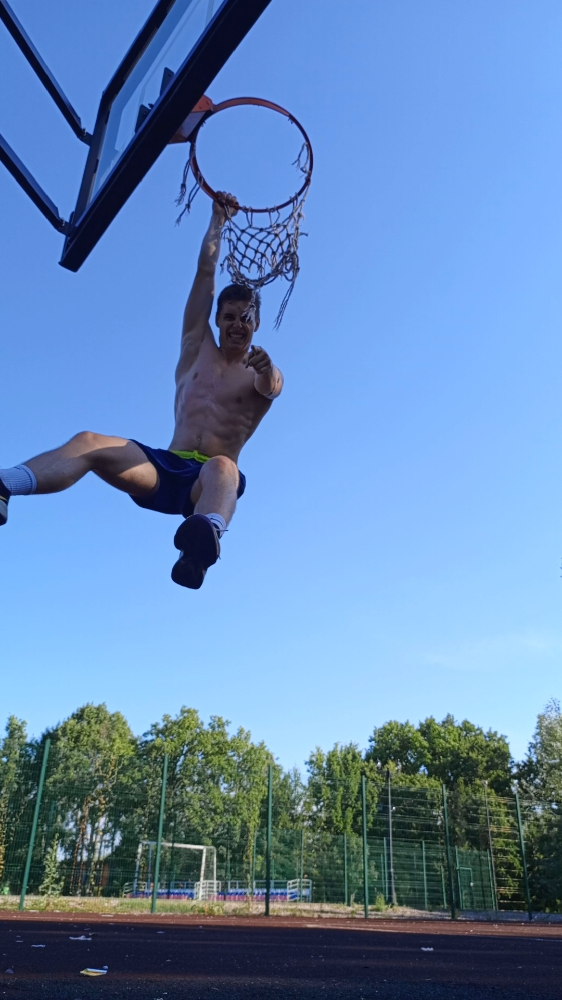

# 🚀 Лабораторная работа №1 по Web-программированию

- **Студент:** Зотов Антон Алексеевич  
- **Группа:** 6401  
- **Научный руководитель:** Котов А.П.  
- **Тема диплома:** Исследование методов визуальной одометрии
---

## 💫 Любимая цитата
> Нет ничего невозможного - на невозможное просто требуется больше времени

##  Или вот ещё одна:
> Программирование — это не о том, чтобы знать все ответы, а о том, чтобы знать, где их найти

